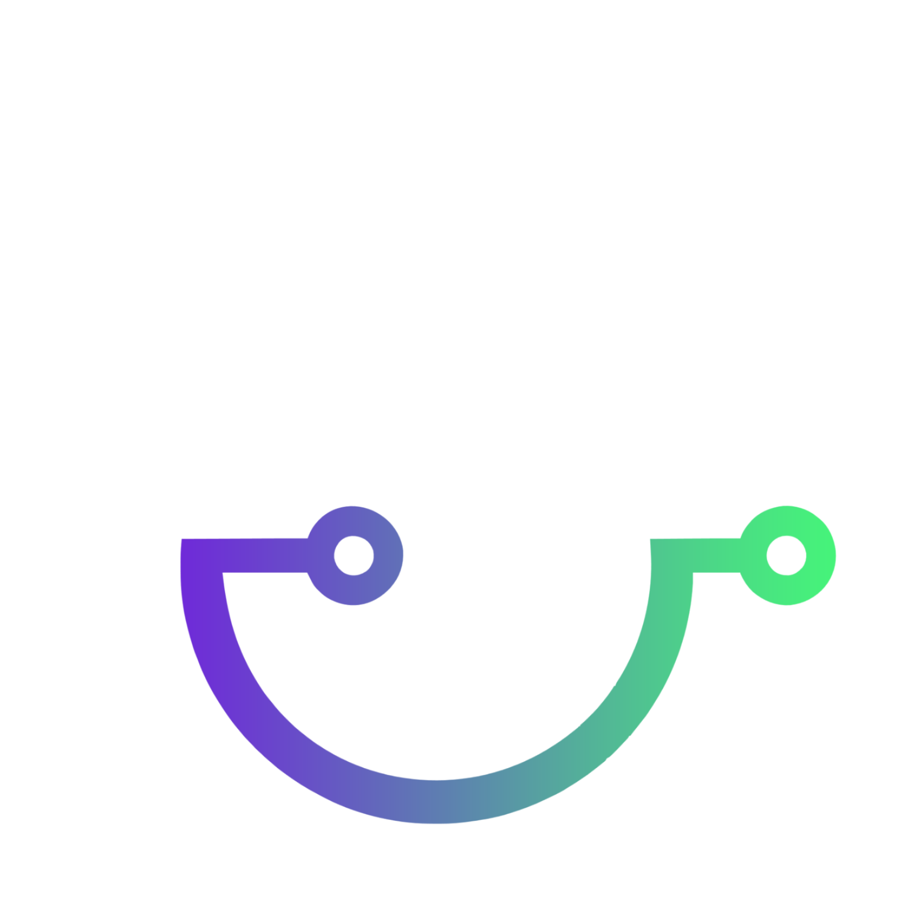

<p align="center">
  
</p>

<p align="center">
  
  
  
  
</p>

---

Chi.Bio Nexus es la capa de software para los biorreactores [Chi.Bio](https://chi.bio/): control remoto desde el navegador, visualización en tiempo real de OD y tasa de crecimiento, editor visual de protocolos con asistencia de IA (Google Gemini), y streaming de cámara vía WebRTC. Corre en una **BeagleBone Black** conectada al hardware Chi.Bio y se expone al exterior vía **Cloudflare Tunnel**. El panel de escritorio Windows (`ChiBioNexus-Real.exe`) gestiona los servicios, la red y el acceso con un solo clic.

---

## Características

| | |
|---|---|
| **Control en tiempo real** | Bombas, agitación, temperatura, LEDs, UV |
| **Monitoreo** | OD, tasa de crecimiento (μ), temperatura, actividad de bombas |
| **Architect** | Editor visual de protocolos con generación y análisis de código Python via IA |
| **Cámara WebRTC** | Stream de video H.264 1280×720 @ 30 fps |
| **Acceso remoto** | Cloudflare Tunnel — acceso desde cualquier navegador sin abrir puertos |

## Stack

| Capa | Tecnología |
|---|---|
| Backend | Python · Flask · Gunicorn |
| Hardware | BeagleBone Black (ARM Cortex-A8, Debian Linux 32-bit) |
| Frontend | Vanilla JS · jQuery · Google Charts |
| IA | Google Gemini 2.5 Flash Lite |
| Cámara | FastAPI · aiortc · OpenCV · WebRTC H.264 |
| Acceso remoto | Cloudflare Tunnel |

---

## Panel de control

`lanzador_real.py` / `ChiBioNexus-Real.exe` — GUI de escritorio Windows para el hardware real.

| Página | Función |
|---|---|
| **Inicio** | Estado del sistema (red, BeagleBone, cámara, túnel) · diagnóstico · reporte `.txt` |
| **Red** | Servicios NSSM (ChibioCamera, ChibioTunnel) · botón "Instalar todo" |
| **Índices** | Detectar y persistir índices WiFi/USB · compartir red a la BeagleBone |
| **Cámara** | Preview del stream en el navegador |
| **Ajustes** | Dominios del túnel · cambiar entre modo túnel / LAN |

Primera ejecución: wizard para elegir entre túnel Cloudflare y acceso solo-LAN. El botón **"Abrir Nexus"** en la barra superior selecciona automáticamente la URL correcta. Incluye tour guiado de 8 pasos.

---

## Compilar ejecutables

```powershell
pip install pyinstaller
.\compilar.ps1
```

Genera en la raíz del proyecto:

- **`ChiBioNexus-Demo.exe`** — simulador completo sin hardware (3 reactores ficticios, Architect, IA)
- **`ChiBioNexus-Real.exe`** — panel de control PC; colocarlo junto al repositorio clonado para que "Instalar todo" encuentre los scripts y dependencias

---

## Despliegue en BeagleBone Black

**Hardware requerido:** [BeagleBone Black](https://beagleboard.org/black) con Debian, dispositivo Chi.Bio por I2C, PC Windows conectado por USB.

```bash
# Copiar proyecto
scp -r chibio_nexus/ root@192.168.7.2:/root/chibio/

# En la BeagleBone (via PuTTY → 192.168.7.2)
cd /root/chibio && bash scripts/beaglebone/setup_beaglebone.sh

# Iniciar servidor
bash scripts/beaglebone/cb.sh
```

Compartir la red del PC a la BeagleBone desde `lanzador_real.py` (página Índices) o con `scripts\pc\compartir_red_beaglebone.ps1`.

Para reiniciar el servidor:

```bash
pkill -f gunicorn && sleep 2 && bash scripts/beaglebone/cb.sh
```

> Cambios en `static/` — solo `Ctrl+Shift+R`. Cambios en `templates/` o `app.py` — reiniciar gunicorn.

---

## Estructura del proyecto

<p align="center">
  
</p>

```
chibio_nexus/
├── app.py                     ← Servidor Flask (BeagleBone)
├── mock_server.py             ← Servidor simulado (demo sin hardware)
├── protocolo_mock.py          ← Protocolo de ejemplo para el simulador
├── lanzador_dev.py            ← Lanzador del simulador
├── lanzador_real.py           ← Panel de control GUI (PC, hardware real)
├── compilar.ps1               ← Genera ChiBioNexus-Demo.exe y ChiBioNexus-Real.exe (PyInstaller)
├── config.example.py          ← Template de configuración (Gemini API key)
├── config_pc.example.py       ← Template de configuración del PC (túnel, hostnames)
├── requirements.txt           ← Dependencias BeagleBone
├── requirements-windows.txt   ← Dependencias PC Windows
├── assets/
│   ├── logo.png               ← Logo del proyecto
│   ├── logo_negro.png
│   └── nexus.ico              ← Icono de los ejecutables
├── camera/
│   └── webrtc_server.py       ← Servidor de cámara WebRTC (Windows)
├── scripts/
│   ├── pc/                    ← Scripts Windows (PC)
│   │   ├── instalar_todo.ps1            ← Setup completo (1 click)
│   │   ├── instalar_servicios.ps1       ← Instala servicios NSSM
│   │   ├── activar_servicios_pc.ps1     ← Inicia servicios ya instalados
│   │   ├── desactivar_servicios_pc.ps1  ← Detiene servicios ya instalados
│   │   ├── reiniciar_servicio.ps1       ← Reinicia un servicio NSSM específico
│   │   └── compartir_red_beaglebone.ps1 ← Configuración de red ICS
│   └── beaglebone/             ← Scripts Linux (BeagleBone)
│       ├── cb.sh                         ← Inicio del servidor
│       └── setup_beaglebone.sh           ← Instalación inicial
├── templates/
│   ├── index.html             ← Interfaz principal (Nexus)
│   ├── architect.html         ← Editor de protocolos (Architect)
│   └── mobile_blocked.html    ← Página de bloqueo para dispositivos móviles
└── static/
    ├── HTMLScripts.js         ← Script original Chi.Bio
    ├── logo.png
    ├── logo_negro.png
    ├── css/
    │   ├── nexus.css
    │   └── architect.css
    └── js/
        ├── nexus.js
        └── architect.js
```

---

## Autor

Desarrollado por **Juan David Romero Montes**.  
Basado en el hardware open-source [Chi.Bio](https://chi.bio/) (Harrison & Dunlop, 2020).
